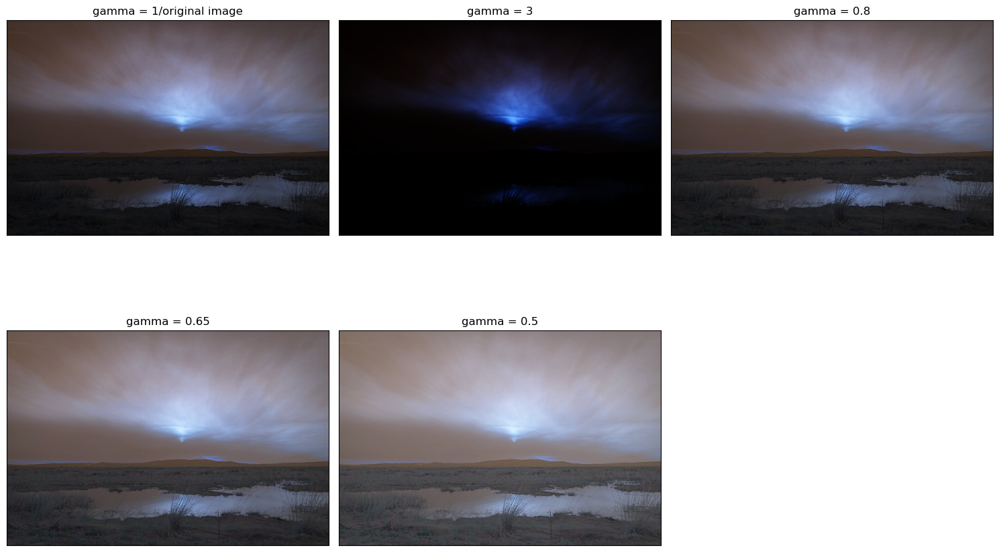

# Computer Vision Assignment 

## 📌 Overview
This repository contains solutions for **Assignment of Computer Vision **. The tasks involve implementing various image processing and computer vision techniques, including morphological operations, clustering, feature detection, Hough transforms, and background subtraction.

---

## ✅ Problem Statements

1. **Top-hat/Bottom-hat Filtering & Thresholding**
   - Preprocess `morf_test.png` using top-hat or bottom-hat filtering.
   - Estimate and subtract background.
   - Apply global thresholding.
   - Optionally apply noise filtering and morphological operations to improve segmentation.

2. **Image Segmentation using K-Means & Mean Shift**
   - Segment `white-flower.png`, `butterfly.jpg`, and `camel.jpg` using:
     - K-Means clustering
     - Mean Shift clustering
   - Compare results of both methods.

3. **Corner Detection**
   - Detect corners in a chessboard image using **Harris Corner Detector**.

4. **Hough Transform for Lines & Circles**
   - Detect **lines** in a chessboard image.
   - Detect **circles** in `coins.jpg`.

5. **Feature Matching using SIFT**
   - Match an object between two images (`image1.png` and `image2.png`).
   - Use SIFT for feature detection and **Brute-Force Matching**.

6. **Moving Vehicle Detection**
   - Identify moving vehicles using **Median Differencing Background Subtraction**.
   - Test on `traffic.mp4`.
   - Analyze performance based on results.

---

7. **Image Scaling using Interpolation**
   - Given the image `lenna.png` (220x220 pixels):
     - Apply **bilinear** and **nearest-neighbor interpolation** to scale up the image.
     - Compare results based on **smoothness**, **sharpness**, and **artifacts**.

8. **Geometric Transformation with Affine Matrix**
   - Implement an **affine transformation** (hand-coded).
   - Apply to `cameraman.jpg`:
     - Translate by **25 pixels right** and **30 pixels down**.
     - Expand by **2.0x horizontally** and shrink by **0.5x vertically**.
   - Compare results with **OpenCV inbuilt function**.

9. **Histogram Equalization & Gamma Correction**
   - Perform **histogram equalization** on `home.jpg`.
   - Apply **gamma correction** on `sunset.jpg` using multiple gamma values.
   - Find the best gamma-corrected result.
   - Compare histogram equalization vs best gamma correction.

10. **Spatial Filtering**
    - Implement:
      - **Averaging filter**
      - **Weighted averaging filter**
      - **Median filter (3x3, 5x5)**
    - Apply on `noise.tiff` and `car.png`.
    - Find **optimum kernel size** for median filter (clear features, minimal noise).
    - Do NOT use built-in spatial filtering functions.

11. **Template Matching using Correlation**
    - Find the largest correlation spot in `hills.jpg` using **linear filtering-based template matching**.
    - Template: `template.png`.
    - Draw a **bounding box** at matched location.

12. **Edge Detection (Bonus)**
    - Complete `edge_detection(img)`:
      - Normalize image to [0,1]
      - Apply Gaussian smoothing (σ=0.5)
      - Compute **gradient magnitude & angle**
      - Apply **Non-Maximal Suppression** (8 directions, each 45°)
    - Input: `coins.jpg`
    - Output: gradient magnitude, angle image, and NMS image.

---

## 🛠 Technologies & Libraries Used
- **Python 3.x**
- **OpenCV** (`opencv-python`, `opencv-contrib-python`)
- **NumPy** – numerical computations
- **Matplotlib** – data visualization & plotting
- **Scikit-learn** – clustering (KMeans)
- **Scipy** – image filtering & transformations
- **Pandas** – for any optional data handling
- **Jupyter Notebook** – for interactive execution

---


## 📂 Repository Structure
```
├── CV_Assignment/          # Folder for all the code
├── images/                 # Folder for input images 
├── outputs/                # Folder for output results 
└── README.md
```

<!-- 
---

## ▶ How to Run
1. Clone the repository:
   ```bash
   git clone https://github.com/<your-username>/CV-Assignment-2.git
   cd CV-Assignment-2
   ```
2. Install dependencies:
   ```bash
   pip install opencv-python opencv-contrib-python numpy matplotlib scikit-learn
   ```
3. Open Jupyter Notebook:
   ```bash
   jupyter notebook CV_Assignment_2.ipynb
   ```
4. Run each cell to reproduce results.

--- -->

## 📥 Input Images & Videos
All input files are in the `images/` folder:
<!--- `morf_test.png`
- `white-flower.png`, `butterfly.jpg`, `camel.jpg`
- `chessboard.jpg`, `coins.jpg`
- `image1.png`, `image2.png`-->


---

## 📤 Output Results
All output results are in the `outputs/` folder.  

### Q1 – Morphological Processing
_Input:_  


_Output:_  


---

### Q2 – KMeans vs Mean Shift Segmentation
_Input:_  
<p align="center">
  
  
  
</p>


_Output:_  
KMeans:  
  


---

### Q3 – Harris Corner Detection
_Input:_  


_Output:_  


---

### Q4 – Hough Transform
Lines:  
  
_Input:_ 

Circles:  


---

### Q5 – SIFT Feature Matching


---

#### **Q7 – Image Scaling**
**Input:**  


**Output:**  
- Nearest Neighbor & Bilinear Comparison:  
  
- Transformed Image:  


---

#### **Q8 – Affine Transformation**
**Input:**  


**Output:**  
- Combined Inbuilt vs Custom Transformation:  
  
- Individual Transformations:  
  - Translation:  
      
  - Scaling:  
      
  - Rotation:  
      
  - Shearing:  
      
      
- Inbuilt vs Custom for Each:  
    
    
    
    

---

#### **Q9 – Histogram Equalization & Gamma Correction**
**Inputs:**  
  


**Outputs:**  
- Histogram Comparisons:  
    
    
- Equalized vs CLAHE:  
    
    
    
    
- Gamma Correction:  
    
    
- Comparison of Methods:  
    
    

---

#### **Q10 – Spatial Filtering**
**Inputs:**  
  


**Outputs:**  
- Average Filters:  
    
    
- Median Filters:  
    
    
- Inbuilt Comparison:  
    

---

#### **Q11 – Template Matching**
**Input:**  
  


**Output:**  


---

#### **Q12 – Edge Detection**
**Input:**  


**Outputs:**  
- Gradient Magnitude & Edge Detection:  
    
    

---


<!--### Q6 – Moving Vehicle Detection
_Add a GIF or short video:_  
-->

---


## 📈 Results & Observations

### **Assignment **
- **Q1:** Background estimation and morphological filtering significantly improved thresholding results.
- **Q2:** Mean Shift produced more accurate segmentation for complex regions compared to KMeans.
- **Q3:** Harris Corner Detector successfully detected chessboard corners.
- **Q4:** Hough Transform effectively detected both lines and circles.
- **Q5:** SIFT feature matching accurately matched keypoints across two images.
- **Q6:** Median differencing was effective for moving vehicle detection but may fail under shadows and lighting changes.
- **Q7:** Bilinear interpolation produced smoother images compared to nearest-neighbor, which appeared blocky.
- **Q8:** Affine transformation implementation worked as expected; results were consistent with OpenCV’s built-in function.
- **Q9:** Histogram equalization enhanced overall contrast, while gamma correction allowed better control of brightness for specific gamma values.
- **Q10:** Median filter (size 5×5) provided the best noise reduction with minimal detail loss compared to averaging filters.
- **Q11:** Template matching successfully located the object using correlation, though performance depends on noise and lighting.
- **Q12:** Edge detection pipeline worked effectively; non-maximum suppression preserved strong edges while reducing noise.


